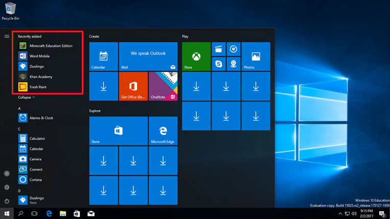
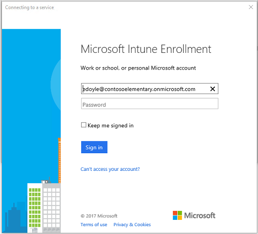
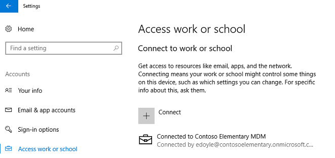

# Finish Windows 10 device setup and other tasks

> [!div class="step-by-step"]
[<< Set up Windows 10 education devices](set-up-windows-10-education-devices.md)

Once you've set up your Windows 10 education device, it's worth checking to verify the following:

> [!div class="checklist"]
> * Correct device setup
> * Device is Azure AD joined

You can watch the video to see how this is done, or follow the step-by-step guide.  

> [!VIDEO https://www.youtube.com/embed/nhQ_4okWFmk]

You can watch the descriptive audio version here: [Microsoft Education: Verify Windows 10 education devices are Azure AD joined and managed (DA)](https://www.youtube.com/watch?v=_hVIxaEsu2Y)

## Verify correct device setup
Verify that the device is set up correctly and boots without any issues.

**Verify that the device was set up correctly**
1. Confirm that the Start menu contains a simple configuration.
2. Confirm that the Store and built-in apps are installed and working. The apps pushed down from Intune for Education will appear under **Recently added**. 

  > [!NOTE]  
  > It may take some time before some apps are pushed down to your device from Intune for Education. Check again later if you don't see some of the apps you provisioned for the user.

  **Figure 1** - Sample list of apps for a user

  

## Verify the device is Azure AD joined
Let's now verify that the device is joined to your organization's Azure AD and shows up as being managed in Microsoft Intune for Education.

**Verify if the device is joined to Azure AD**
1. Log in to the <a href="https://intuneeducation.portal.azure.com/" target="_blank">Intune for Education console</a>.
2. Select **Groups** and select **All Devices**.
3. In the **All Devices** page, see the list of devices and verify that the device you're signed into appears on the list.

  **Figure 2** - List of all managed devices

  

4. On the Windows 10 education device, click **Start** and go to **Settings**. 
5. Select **Accounts > Access work or school**.
6. In the **Access work or school** page, confirm that the device is connected to the organization's Azure AD.

  **Figure 3** - Confirm that the Windows 10 device is joined to Azure AD

  

**That's it! You're done!** You've completed basic cloud setup, deployment, and management using Microsoft Education. 

You can follow the rest of the walkthrough to finish setup and complete other tasks, such as:

> [!div class="checklist"]
> * Update group settings in Intune for Education
> * Configure Azure settings
> * Complete Office 365 for Education setup
> * Enable Microsoft teams for your school
> * Add more users
> * Connect other devices, like BYOD devices, to your cloud infrastructure

You can watch the following video to see how to update group settings in Intune for Education and configure Azure settings. Or, you can follow the step-by-step guide for these tasks and the other tasks listed above.

> [!VIDEO https://www.youtube.com/embed/M6-k73dZOfw]

You can watch the descriptive audio version here: [Microsoft Education: Update settings, apps, and Azure AD settings for your education tenant (DA)](https://www.youtube.com/watch?v=-Rz3VcDXbzs)

## Update group settings in Intune for Education
If you need to make changes or updates to any of the apps or settings for the group(s), follow these steps.

1. Log in to the <a href="https://intuneeducation.portal.azure.com/" target="_blank">Intune for Education console</a>.
2. Click **Groups** and then choose **Settings** in the taskbar at the top of the page.
3. You will see the same settings groups that you saw in express setup for Intune for Education as well as other settings categories such as **Windows Defender settings**, **Device sharing**, **Edition upgrade**, and so on.

  **Figure 4** - See the list of available settings in Intune for Education

  

4. Keep the default settings or configure the settings according to your school's policies. 

  For example, you can configure the diagnostic data sent to Microsoft in **Basic device settings > Send diagnostic data**. 

5. Click **Save** or **Discard changes**.

## Configure Azure settings
After completing the basic setup for your cloud infrastructure and confirming that it is up and running, it's time to prepare for additional devices to be added and enable capabilities for the user to use.

### Enable many devices to be added by a single person 
When a device is owned by the school, you may need to have a single persion adding many devices to your cloud infrastructure. 

Follow the steps in this section to enable a single person to add many devices to your cloud infrastructure.

1. Sign in to the <a href="https://portal.office.com" target="_blank">Office 365 admin center</a>.
2. Configure the device settings for the school's Active Directory. To do this, go to the new Azure portal, <a href="https://portal.azure.com" target="_blank">https://portal.azure.com</a>.
3. Select **Azure Active Directory > Users and groups > Device settings**.

  **Figure 5** - Device settings in the new Azure portal

  

4. Find the setting **Maximum number of devices per user** and change the value to **Unlimited**.
5. Click **Save** to update device settings.

### Enable roaming settings for users
When students move from using one device to another, they may need to have their settings roam with them and be made available on other devices. 

Follow the steps in this section to ensure that settings for the each user follow them when they move from one device to another.

1. Sign in to the <a href="https://portal.office.com" target="_blank">Office 365 admin center</a>.
3. Go to the new Azure portal, <a href="https://portal.azure.com" target="_blank">https://portal.azure.com</a>.
3. Select **Azure Active Directory > Users and groups > Device settings**.
4. Find the setting **Users may sync settings and enterprise app data** and change the value to **All**.

  **Figure 6** - Enable settings to roam with users

  

5. Click **Save** to update device settings.

## Complete Office 365 for Education setup
Now that your basic cloud infrastructure is up and running, it's time to complete the rest of the Office 365 for Education setup. You can find detailed information about completing Office 365 setup, services and applications, troubleshooting, and more by reading the <a href="https://support.office.com/Article/6a3a29a0-e616-4713-99d1-15eda62d04fa#ID0EAAAABAAA=Education" target="_blank">Office 365 admin documentation</a>.

## Enable Microsoft Teams for your school
Microsoft Teams is a digital hub that brings conversations, content, and apps together in one place. Because it's built on Office 365, schools benefit from integration with their familiar Office apps and services. Your institution can use Microsoft Teams to create collaborative classrooms, connect in professional learning communities, and communicate with school staff all from a single experience in Office 365 for Education. 

To get started, IT administrators need to use the Office 365 Admin Center to enable Microsoft Teams for your school. 

**To enable Microsoft Teams for your school**

1. Sign in to <a href="https://portal.office.com" target="_blank">Office 365</a> with your work or school account.
2. Click **Admin** to go to the Office 365 admin center.
3. Go to **Settings > Services & add-ins**.
4. On the **Services & add-ins** page, select **Microsoft Teams**.

  **Figure 1** - Select Microsoft Teams from the list of services & add-ins

  

5. On the Microsoft Teams settings screen, select the license that you want to configure, **Student** or **Faculty and Staff**. Select **Faculty and Staff**.

  **Figure 2** - Select the license that you want to configure

  

6. After you select the license type, set the toggle to turn on Microsoft Teams for your organization.

  **Figure 3** - Turn on Microsoft Teams for your organization

  

7. Click **Save**.

You can find more info about how to control which users in your school can use Microsoft Teams, turn off group creation, configure tenant-level settings, and more by reading the *Guide for IT admins* getting started guide in the <a href="https://aka.ms/MeetTeamsEdu" target="_blank">Meet Microsoft Teams</a> page.

## Add more users
After your cloud infrastructure is set up and you have a device management strategy in place, you may need to add more users and you want the same policies to apply to these users. You can add new users to your tenant simply by adding them to the Office 365 groups. Adding new users to Office 365 groups automatically adds them to the corresponding groups in Intune for Education.

See <a href="https://support.office.com/article/435ccec3-09dd-4587-9ebd-2f3cad6bc2bc" target="_blank">Add users to Office 365</a> to learn more. Once you're done adding new users, go to the <a href="https://intuneeducation.portal.azure.com/" target="_blank">Intune for Education console</a> and verify that the same users were added to the Intune for Education groups as well.

## Connect other devices to your cloud infrastructure
Adding a new device to your cloud-based tenant is easy. For new devices, you can follow the steps in [Set up Windows 10 education devices](set-up-windows-10-education-devices.md). For other devices, such as those personally-owned by teachers who need to connect to the school network to access work or school resources (BYOD), you can follow the steps in this section to get these devices connected.

  > [!NOTE]  
  > These steps enable users to get access to the organization's resources, but it also gives the organization some control over the device.

**To connect a personal device to your work or school**

1. On your Windows device, go to **Settings > Accounts**.
2. Select **Access work or school** and then click **Connect** in the **Connect to work or school** page.
3. In the **Set up a work or school account** window, enter the user's account info.

  For example, if a teacher connects their personal device to the school network, they'll see the following screen after typing in their account information.

  **Figure 7** - Device is now managed by Intune for Education

  

4. Enter the account password and then click **Sign in** to authenticate the user.

   Depending on the organization's policy, the user may be asked to update the password.

5. After the user's credentails are validated, the window will refresh and will now include an entry that shows the device is now connected to the organization's MDM. This means the device is now enrolled in Intune for Education MDM and the account should have access to the organization's resources.

  **Figure 8** - Device is connected to organization's MDM

  

6. You can confirm that the new device and user are showing up as Intune for Education-managed by going to the Intune for Education management portal and following the steps in [Verify the device is Azure AD joined](#verify-the-device-is-azure-ad-joined). 

  It may take several minutes before the new device shows up so check again later.

> [!div class="step-by-step"]
[<< Set up Windows 10 education devices](set-up-windows-10-education-devices.md)

  
## Related topic
[Get started: Deploy and manage a full cloud IT solution with Microsoft Education](get-started-with-microsoft-education.md)
