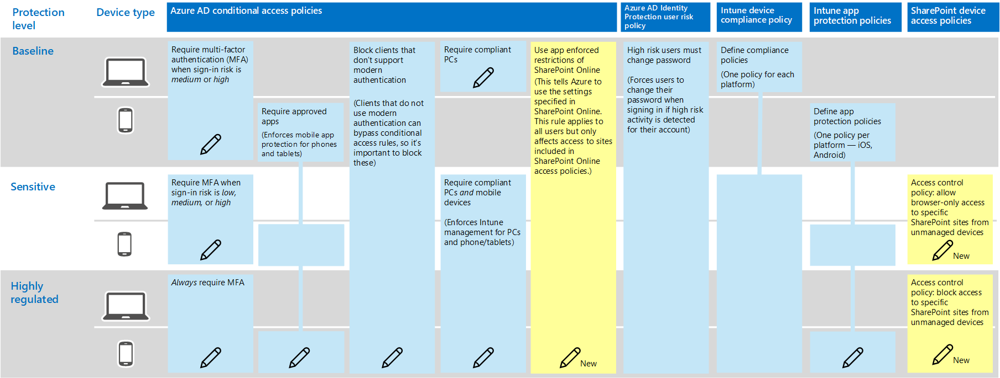

# Policy recommendations for securing SharePoint Sites and files
This article describes how to implement the recommended identity and device access policies to protect SharePoint Online and OneDrive for Business. This guidance builds on the [Common identity and device access policies](identity-access-policies.md). 

These recommendations are based on three different tiers of security and protection for SharePoint files that can be applied based on the granularity of your needs: **baseline**, **sensitive**, and **highly regulated**. You can learn more about these security tiers, and the recommended client operating systems, referenced by these recommendations in the [the overview](microsoft-365-policies-configurations.md).

In addtion to implementing this guidance, be sure to configure SharePoint sites with the right amount of protection, including ensuring permissions for sensitive and highly regulated content are appropriate. For more information on creating sites for baseline, sensitive, and highly regulated protection, see [Secure SharePoint Online sites and files](https://docs.microsoft.com/en-us/office365/enterprise/secure-sharepoint-online-sites-and-files). 

##Updating common policies to include SharePoint and OneDrive for Business
The following diagram illustrates the set of recommended policies for protecting files in SharePoint Online and OneDrive for Business. It indicates which policies will be updated or newly created to add protection for SharePoint Online and OneDrive for Business.

If you included SharePoint Online when you created the common policies, you only need to create the new polcies. When configuring conditional access rules, SharePoint Online includes OneDrive for Business.

The new policies implement device protection for sensitive and highly regulated content by applying specific access requirements to SharePoint sites that you specify. 

 The following table lists the policies you either need to review and update or create new for SharePoint Online. The common policies link to the associated configuration instructions in the [Common identity and device access policies](identity-access-policies.md) article (links coming soon).

|Protection level|Policies|More information|
|:---------------|:-------|:----------------|
|**Baseline**|[Require MFA when sign-in risk is *medium* or *high*](identity-access-policies.md#require-mfa-based-on-sign-in-risk)|Include SharePoint Online in the assignments of cloud apps.|
|        |[Block clients that don't support modern authentication](identity-access-policies.md#block-clients-that-dont-support-modern-authentication)|Include SharePoint Online in the assignments of cloud apps.|
|        |[Define app protection policies](identity-access-policies.md#define-app-protection-policies)|Be sure all recommended apps are included in the list of apps. Be sure to update the policy for each platform (iOS, Android, Windows).|
|        |[Require compliant PCs](identity-access-policies.md#require-compliant-pcs-but-not-compliant-phones-and-tablets)|Include SharePoint Online in list of cloud apps.|
|        |[Use app enforced restrictions in SharePoint Online](#use-app-enforced-restrictions-in-sharepoint-online)|Add this new policy. This tells Azure AD to use the settings specified in SharePoint Online. This rule applies to all users but only affects access to sites included in SharePoint Online access policies.
|**Sensitive**|[Require MFA when sign-in risk is *low*, *medium* or *high*](identity-access-policies.md#require-mfa-based-on-sign-in-risk)| Include SharePoint Online in the assignments of cloud apps.|
|         |[Require compliant PCs *and* mobile devices](identity-access-policies.md#require-compliant-pcs-and-mobile-devices)|Include SharePoint Online in the list of cloud apps.|
||[SharePoint Online access control policy](#sharepoint-online-access-control-policies): Allow browser-only access to specific SharePoint sites from unmanaged devices|This prevents edit and download of files. User PowerShell to specify sites.|
|**Highly regulated**|[*Always* requrie MFA](identity-access-policies.md#require-mfa-based-on-sign-in-risk)|Include SharePoint Online in the assignments of cloud apps. |
||[SharePoint Online access control policy](#use-app-enforced-restrictions-in-sharepoint-online): Block access to specific SharePoint sites from unmanaged devices|Use PowerShell to specify sites.|

## Use app enforced restrictions in SharePoint Online
If you implement access controls in SharePoint Online, you must create this conditional access policy in Azure AD to tell Azure AD to enforce the policies you configure in SharePoint Online. This rule applies to all users, but only affects access to the sites you specify using PowerShell when you create the access controls in SharePoint Online.

To configure this policy see "Block or limit access to specific SharePoint site collections or OneDrive accounts" in this article: [Control access from unmanaged devices](https://support.office.com/en-us/article/Control-access-from-unmanaged-devices-5ae550c4-bd20-4257-847b-5c20fb053622?ui=en-US&rs=en-US&ad=US).

## SharePoint Online access control policies
Microsoft recommends you protect content in SharePoint sites with sensitive and highly regulated content with device access controls. You do this by creating a policy that specifies the level of protection and the sites to apply the protection to. 
- Sensitive sites — Allow browser-only access. This prevents users from editing and downloading files.
- Highly regulated sites — Block access from unmanaged devices.

See "Block or limit access to specific SharePoint site collections or OneDrive accounts" in this article: [Control access from unmanaged devices](https://support.office.com/en-us/article/Control-access-from-unmanaged-devices-5ae550c4-bd20-4257-847b-5c20fb053622?ui=en-US&rs=en-US&ad=US) . 

<!---
##Block access to content from unmanaged devices (SharePoint admin center)
In the case of SharePoint Online, when a conditional access policy is applied to enforce Intune app protection policies, this might not apply to all applications that access SharePoint Online. Some applications, such as Exchange, have access to some SharePoint resources. For example, Exchange allows attaching SharePoint files by default. Conditional access policies applied to SharePoint Online will not restrict this access. 

To ensure baseline protection is applied uniformly, regardless of which service is accessing SharePoint Online and OneDrive for Business, configure access controls directly in SharePoint admin center. We recommend you configure the following:
- Block access from unmanaged devices. This includes devices that aren't compliant or joined to a domain. 
- Block access from app that don't use modern authentication.

See [Control access from unmanaged devices](https://support.office.com/en-us/article/Control-access-from-unmanaged-devices-5ae550c4-bd20-4257-847b-5c20fb053622?ui=en-US&rs=en-US&ad=US).
-->

## Next steps
[Secure SharePoint Online sites and files](https://docs.microsoft.com/en-us/office365/enterprise/secure-sharepoint-online-sites-and-files)
