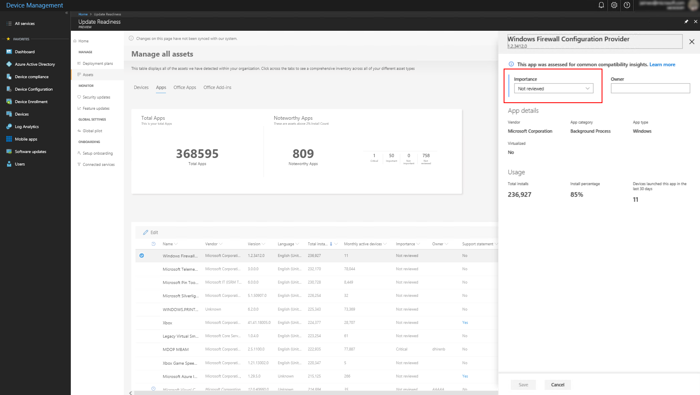
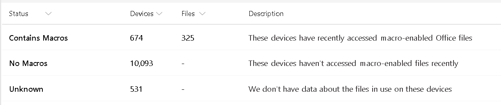
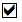

[This information relates to a pre-released product which may be substantially modified before it's commercially released. Microsoft makes no warranties, express or implied, with respect to the information provided here.]

# Additional steps after device enrollment

This topic explains the steps you should take once device enrollment is complete.


## Review assets

Once device enrollment is complete, you should review carefully the inventory of reported devices and other assets to determine if any are missing or are reporting unexpected data. Your devices, drivers, apps, Office apps, Office add-ins, and Office macros are visible as items under **Assets**:

[](UDRimages/UDR-main-assets.png)

### Devices

Key information about all devices in your organization that are enrolled. You can sort on any column or filter for particular values.

>[!NOTE]
>If the dashboard isn't reporting the number of devices you are expecting to see for your environment, consult [Desktop Analytics troubleshooting](update-readiness-troubleshooting.md) for steps to take to address the issue.

### Apps

Similarly, the Apps tab shows all installed apps detected on your Windows devices.

[](UDRimages/UDR-assets-apps2.png)

"Noteworthy" apps are those that are installed on more than 2% of enrolled devices. You can change the threshold of "noteworthy" by {doing something}. You can also set the *Importance* of apps by categorizing them into these categories:

- Critical
- Important
- Ignore
- Not reviewed

To set the importance of an app, click it to get its detailed view, and then use the **Importance** pull-down menu to choose a value. You can also assign an owner, as in this example from Office add-ins:

[](UDRimages/UDR-app-detail2.png)

### Office apps

Office apps (such as Microsoft Word or Excel) are displayed similarly, though there is no categorization or "noteworthy" count. You set the importance and owner for the Office app the same way as with other apps or add-ins.

### Office add-ins

Office add-ins (for example, an e-mail scanner or iCloud add-in) are displayed similarly, including the "noteworthy" count and the means to categorize importance as with apps. You can view details of any add-in by clicking it.

### Office macros

This section shows whether reporting devices have accessed any files recently that are capable of including macros. (For a detailed list of these file types, see [File formats supported in the 2007 Office system (corrected)](https://blogs.technet.microsoft.com/office_resource_kit/2009/04/04/file-formats-supported-in-the-2007-office-system-corrected/) at the Office IT Pro blog.)

[](UDRimages/UDR-assets-macros.png)

>[!NOTE]
>If you have run the Readiness Toolkit [LINK](https://aka.ms/readinesstoolkit) on any devices in your environment, additional data from those devices will be displayed here as well. However, there is no need to obtain or run the Readiness Toolkit to use any aspect of Desktop Analytics.

## View the current state of your environment

Knowing the current status of updates in your environment will be helpful as you formulate a deployment plan now that devices are enrolled.

### Security updates

To review the current status of security updates, select **Security updates** in the **Monitor** section of Desktop Analytics:

[](UDRimages/UDR-security-status.png)

This view summarizes security updates for devices that are running Windows or Office (scoped to devices with Click-To-Run installation of Office) {what does this mean?}. The total number of devices considered for both Windows and Office is shown to the left of the bar chart. Devices in the bar chart are categorized as follows:

| **Label**  | **Definition**  |
|---------------------------------------------------------|-----------|
| Latest | Devices are running the latest security update per release version and release channel.|
| Latest-1 | Devices are running a security update one release older than the latest available update on that channel and a build that is not the most current. |
| Older | Devices are running a security update older than Latest -1. |
| Not measured | Devices which Desktop Analytics has not assessed. For Windows, this includes devices running Windows 7 or Windows 8.1. For Office, this includes devices with Office 365 ProPlus that are in Insider channels {what is the minimum version?}, perpetual versions of Office that use a Windows installer (for example, Office 2016, Office 2013, and Office 2010), and Office 365 ProPlus devices that have not returned sufficient data to assess the security status. | 

Select **Windows 10** or **Office 365 ProPlus** to see more details for each of those entities. You can also select **Security updates** in the **Monitor** section of Desktop Analytics. For more details about monitoring, see [Monitor the health and update status of devices](update-readiness-monitoring.md).

### Feature updates

To review the current status of feature updates, select **Feature updates** in the **Monitor** section of Desktop Analytics:

[](UDRimages/UDR-feature-update.png)

This view summarizes feature updates for devices that are running Windows or Office (scoped to devices with Click-To-Run installation of Office) {what does this mean?}. The total number of devices considered for both Windows and Office is shown to the left of the bar chart. Devices in the bar chart are categorized as follows:

| **Label**  | **Definition**  |
|---------------------------------------------------------|-----------|
| In service | Devices are running the latest feature update per release version and release channel.|
| Near end of service | Devices are running a feature update that is within 90 days of reaching end of service. |
| End of service | Devices are running a feature update which is past the end of service date. For details about end of service dates, see {xlink into relevant section of UDR_monitoring}|
| Not measured | Devices which Desktop Analytics has not assessed. For Windows, this includes devices running Windows 7 or Windows 8.1. For Office, this includes devices with Office 365 ProPlus that are in Insider channels {what is the minimum version?}, perpetual versions of Office that use a Windows installer (for example, Office 2016, Office 2013, and Office 2010), and Office 365 ProPlus devices that have not returned sufficient data to assess the security status. | 

Select **Windows 10** or **Office 365 ProPlus** to see more details for each of those entities. You can also select **Security updates** in the **Monitor** section of Desktop Analytics. For more details about monitoring, see [Monitor the health and update status of devices](update-readiness-monitoring.md).


## Create device groups for easier management
Creating device groups makes it easier to manage things like global exclusions or inclusions.
{STOLEN FROM EXISTING UPGRADE READINESS CONTENT--NEEDS EDITING FOR DA RELEVANCE. INCLUDING TEMPLATE QUERY: template for the query, so people will know which table to use, and to remap to ComputerID
MADevice | <your where clause here to select the devices you want>  | project ComputerID = DeviceId | distinct ComputerID
}

### Getting started with Computer Groups

When you sign in to OMS, you will see a new blade entitled **Computer Groups**. See the following example:


To create a computer group, open **Log Search** and create a query based on **Type=UAComputer**, for example:

```
Type=UAComputer Manufacturer=DELL
```


When you are satisfied that the query is returning the intended results, add the following text to your search:

```
| measure count() by Computer
```

This will ensure every computer only shows up once. Then, save your group by clicking **Save** and **Yes**. See the following example:


Your new computer group will now be available in Upgrade Readiness. See the following example:


### Using Computer Groups

When you drill into a computer group, you will see that computers are categorized by **UpgradeDecision**. For computers with the status **Review in progress** or **Won’t upgrade** you can drill down to view issues that cause a computer to be in each category, or you can simply display a list of the computers in the category. For computers that are designated **Ready to upgrade**, you can go directly to the list of computers that are ready.


Viewing a list of computers in a certain status is self-explanatory, Let’s look at what happens when you click the details link on **Review in progress**:


Next, select if you want to see application issues (**UAApp**) or driver issues (**UADriver**). See the following example of selecting **UAApp**:


A list of apps that require review so that Dell Computers are ready for upgrade to Windows 10 is displayed.


## Set global exclusions and inclusions

If you haven't already, we recommend configuring your global pilot settings before creating a deployment plan. In these settings, you choose devices that should always be included in or excluded from the pilot stage of a deployment. For example, if you exclude the group Executives, the devices in that group will never be recommended as part of a pilot deployment.


1. On the dashboard, click **Global pilot**.
2. Click **Manage groups for inclusion**, and then choose the groups that should be always be part of the pilot.
3. Click **Manage groups for exclusion**, and then choose the groups that should never be part of a pilot. 

{WE PROBABLY NEED MORE HERE ABOUT HOW TO USE--AND NOT USE--THESE SETTINGS}


| | |
| --- | --- |
|  | Learn about Desktop Analytics |
|  | Get started with accounts, subscriptions, user access, workspaces: [Get started with Desktop Analytics](update-readiness-get-started.md) |
|  | Enroll devices in Desktop Analytics to start the flow of diagnostic data: [Enroll devices in Desktop Analytics](update-readiness-enroll-devices.md)|
|  | Additional steps after device enrollment in Desktop Analytics: [Additional steps after device enrollment in Desktop Analytics](update-readiness-additonal-steps.md) (this topic) |
| | Set up deployment plans -- define global rules and detailed deployment plans for pilot and production: [Define deployment plans with Desktop Analytics](update-readiness-deployment-plans.md) |
|  | [Deploy pilot with Desktop Analytics](update-readiness-deploy-pilot.md) |
|  | Deploy to production: [Deploy to production with Desktop Analytics](update-readiness-deploy-production.md) |
|  | Monitor status and health of the deployment: [Monitor the health and update status of devices](update-readiness-monitoring.md) |
|                                      |                                                    |
|    | Additional information: [Troubleshooting](update-readiness-troubleshooting.md)  |