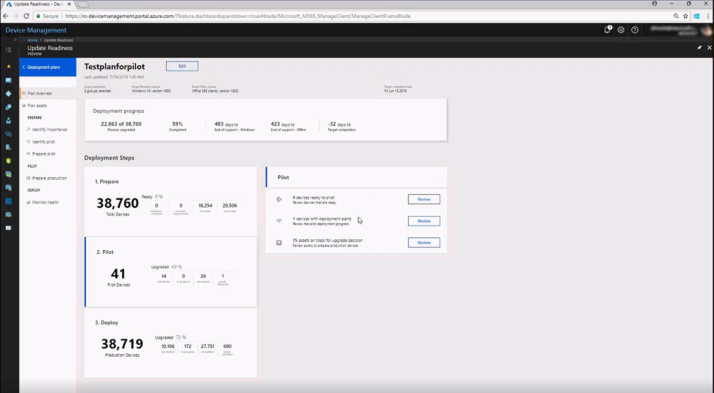
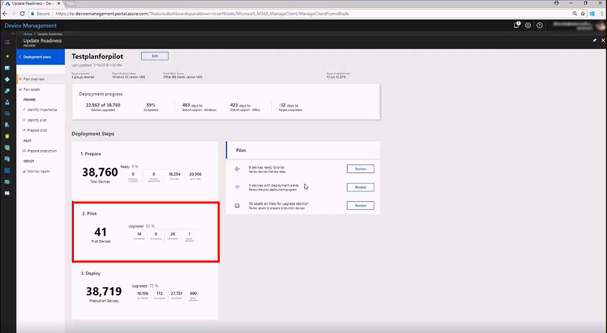
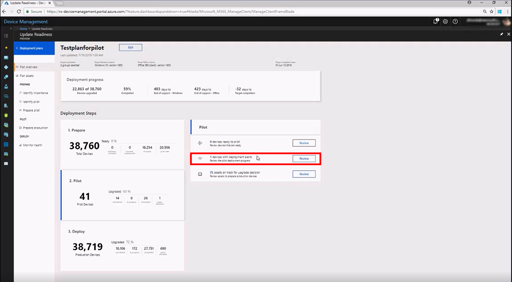
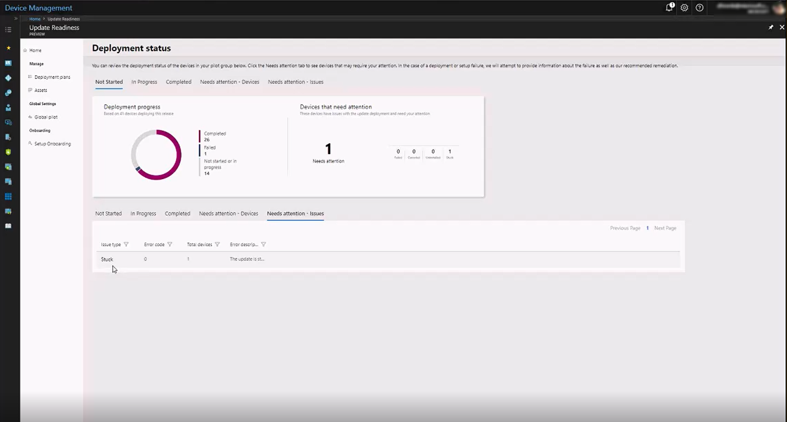
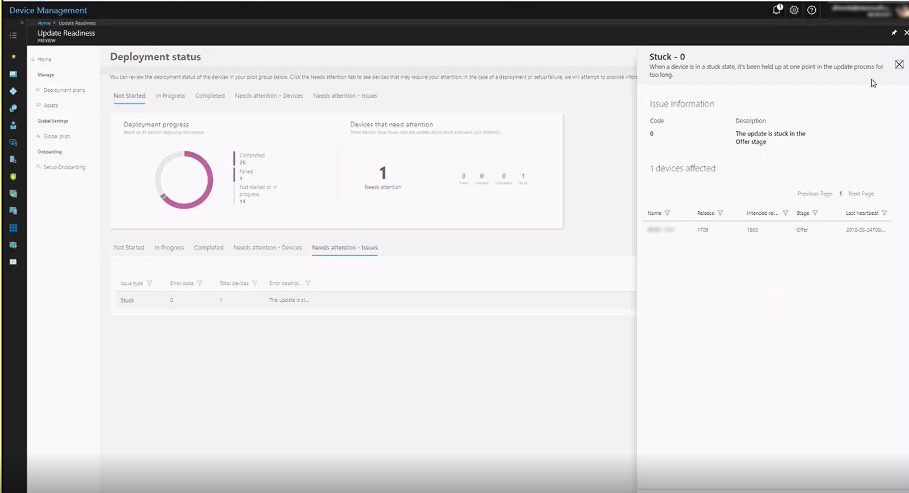

[This information relates to a pre-released product which may be substantially modified before it's commercially released. Microsoft makes no warranties, express or implied, with respect to the information provided here.]

# Deploy the pilot
{some kind of text to prevent stacked headings}

## Address reported issues

In this step, you review any reported issues with the apps, drivers, and {WHAT ELSE?} that might block your deployment, and then approve, reject, or modify the suggested fix. All items in this step must be marked **Ready** or **Ready (with remediation)** before the pilot deployment starts. For detailed information on reviewing apps, see Resolve app and driver issues {this links to existing UpGRADE Readiness topic--do we need to spool up an analogous one for Update Readiness?}

To review issues, follow these steps:

1. On the dashboard, select **Prepare pilot**.
2. On the **Apps** tab, review the apps that need your input.
3. For each app, select the app name and then, in the information pane, review the recommendation and select the upgrade decision. If you choose **Not reviewed** or **Unable**, then devices with this app will not be upgraded during the deployment.
4. Repeat this review for drivers, Office apps, and Office add-ins by using those tabs.

{INSERT GENERAL INFO ON RISK AND HEALTH--XLINK TO SUBTOPICS?}

## Deploy the update to pilot devices
To actually install the update on devices in the pilot deployment, use the System Center Configuration Manager (SCCM) connector. To do this, {DO SOMETHING in Update Readiness}, then refer to {LINK TO RELEVANT SCCM CONTENT}.

## Deploy toolkits if needed (optional)
{GENERAL DESCRIPTION OF AHA AND MACRO TOOLKITS; XLINKS TO DETAILED SUBTOPIC(S) ON SAME}

## Monitor the pilot deployment progress

You can view the current status of any deployment plan, whether it is in preparation, pilot deployment, or production deployment, from a single location by clicking the deployment plan name, which will display this synoptic view:

The **2. Pilot** section summarizes the current state of the pilot deployment, displaying data for the number of devices not started, in progress, completed, or returning issues.

Any devices reporting errors or other issues will also be listed in the Pilot detail area to the right. To get details of the reported issue, click **Review**.

### Address deployment alerts

To get details of reported issues click **Review**. The deployment status details page opens, where you can view lists of the devices in these categories:

- Not started
- In progress
- Completed
- Needs attention - devices
- Needs attention - issues

The **Needs attention** categories show the same information, but sorted differently.

Sorted by affected device:

Sorted by type of issue:

Click a specific listing in either view to get more details about the detected issue:

As you address these deployment issues, the dashboard will continue to show the progress of devices by updating as devices move from **Needs attention** to **Completed**.

You can commence the production deployment at any time you are sufficiently confident in the success of the pilot deployment--there is no requirement that all (or any particular number) of devices in the pilot deployment reach the "completed" state prior to doing so.

{ADD 'NEXT STEPS' OR CHECKLIST FORMAT MATERIAL HERE (see example below)--> next step is 'deploy to production'}

| | |
| --- | --- |
|  | Learn about Update Readiness |
|  | Get started with accounts, subscriptions, user access, workspaces: [Get started with Update Readiness](update-readiness-get-started.md) |
|  | Enroll devices to start the flow of diagnostic data: [Enroll devices in Update Readiness](update-readiness-enroll-devices.md)|
| | Set up deployment plans -- define global rules and detailed deployment plans for pilot and production: [Define deployment plans with Update Readiness](update-readiness-deployment-plans.md) |
|  | [Deploy pilot with Update Readiness](update-readiness-deploy-pilot.md) (this topic) |
|  | Deploy to production: [Deploy to production with Update Readiness](update-readiness-deploy-production.md) |
|  | Monitor status and health of the deployment: [Monitor the health and update status of devices](update-readiness-monitoring.md) |

