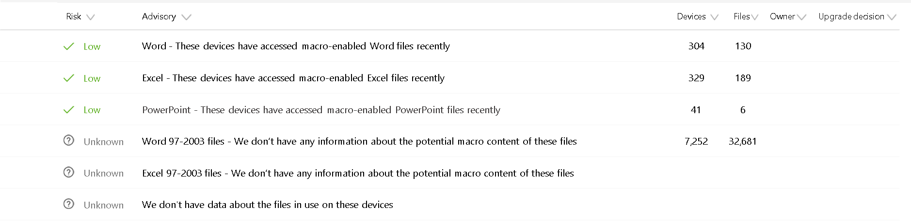
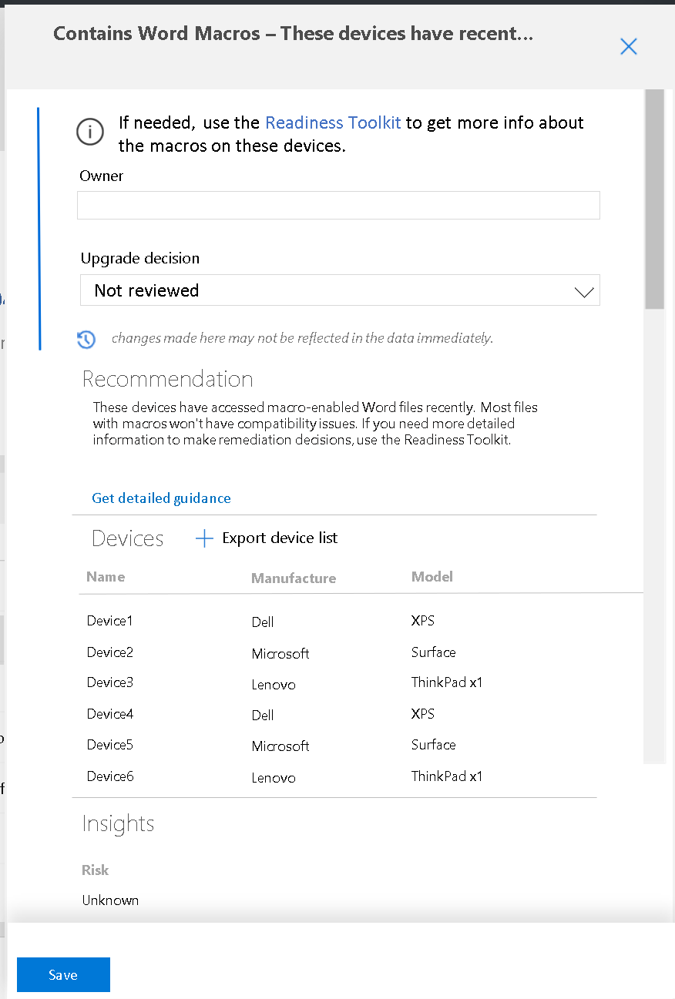

# Deploy the pilot

## Transfer the device file to a management tool

To actually effect the pilot deployment, take the file you exported and import it into System Center Configuration Manager (SCCM) {or other management tool? Which ones work?} For more information and steps to follow in SCCM to start the deployment, see the [LINK TO RELEVANT SCCM TOPIC].

## Monitor the pilot deployment progress

You can view the current status of any deployment plan, whether it is in preparation, pilot deployment, or production deployment, from a single location by clicking the deployment plan name, which will display this synoptic view:

The **2. Pilot** section summarizes the current state of the pilot deployment, displaying data for the number of devices not started, in progress, completed, or returning issues.

Any devices reporting errors or other issues will also be listed in the Pilot detail area to the right. To get details of the reported issue, click **Review**.

### Address deployment alerts

To get details of reported issues click **Review**. The deployment status details page opens, where you can view lists of the devices in these categories:

- Not started
- In progress
- Completed
- Needs attention - devices
- Needs attention - issues

The **Needs attention** categories show the same information, but sorted differently.

Sorted by affected device:

Sorted by type of issue:

Click a specific listing in either view to get more details about the detected issue:

### Office macros

If devices in your environment use Office macros, you can review the usage data and advisories offered by Update Readiness in order to further {inform your decisions about which devices to include in the pilot deployment.}

You can explore further by clicking any specific advisory to see additional details, for example, the relevant list of devices affected. You can also export this list for later use, such as to run the Readiness Toolkit on this subgroup for still more detail about reported issues.

>[!TIP]
>If you plan to run the Readiness Toolkit [LINK] on this subgroup, it's best to wait until after the pilot deployment is complete to delve into remediating the reported macro issues.

As you address these deployment issues, the dashboard will continue to show the progress of devices by updating as devices move from **Needs attention** to **Completed**.

You can commence the production deployment at any time you are sufficiently confident in the success of the pilot deployment--there is no requirement that all (or any particular number) of devices in the pilot deployment reach the "completed" state prior to doing so.

