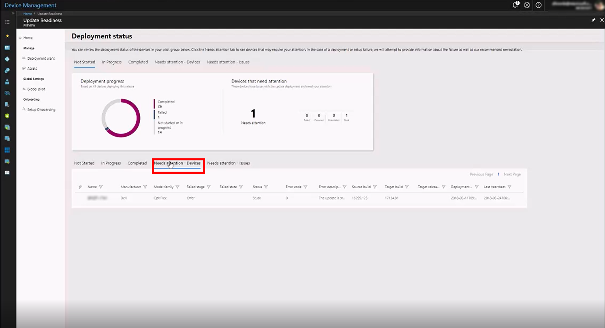

[This information relates to a pre-released product which may be substantially modified before it's commercially released. Microsoft makes no warranties, express or implied, with respect to the information provided here.]

# Deploy to production

You can commence the production deployment at any time you are sufficiently confident in the success of the pilot deployment--there is no requirement that all (or any particular number) of devices in the pilot deployment reach the "completed" state prior to doing so.

Update Readiness will have already determined which devices are ready to upgrade with respect to their operating system and device driver versions (based on the parameters you set earlier in the process), but at this point it remains for the administrator to refine the upgrade decision by reviewing additional assets, such as apps, Office apps, and Office add-ins.

Begin by clicking the **Review** button:

This opens a view where you can review the state of apps, Office apps, and Office add-ins and use that information to set the upgrade decision for each of those assets.

## Review assets

Use each of the tabs to review the status of apps, Office apps, and Office add-ins. In each tabbed view, you can filter the results to show devices that are on track for upgrade (that is, they have no detected issues), those at risk, devices with mixed results, and those in an undetermined state.

As you review each of these specific resources, you set the upgrade decision for it. For example, in the **Apps** tab, if you click a particular app (such as Notepad++ in this image), you can see detailed statistics about its deployment:

Based on the data displayed there, you can set an upgrade decision for that particular app. In this example, the administrator has indicated that the Office app Excel 2016 is upgrade-ready.

Repeat this process for all apps, Office apps, and Office add-ins. Once a given device has a positive upgrade decision for *all* assets (drivers and all apps, Office apps, and Office add-ins installed on it), then its state changes to "ready for production." You can see the current count on the main page for the deployment plan by clicking **3. Deploy**:

### Address deployment alerts

As with the pilot deployment, Update Readiness will advise you of any issues that need your attention prior to starting the production deployment.

To get details of reported issues click **Review**. The deployment status details page opens, where you can view lists of the devices in these categories:

- Not started
- In progress
- Completed
- Needs attention - devices
- Needs attention - issues

The **Needs attention** categories show the same information, but sorted differently.

Sorted by affected device:

Sorted by type of issue:

Click a specific listing in either view to get more details about the detected issue:

### Office macros

If devices in your environment use Office macros, you can review the usage data and advisories offered by Update Readiness in order to further {inform your decisions about which devices to include in the production deployment.}

You can explore further by clicking any specific advisory to see additional details, for example, the relevant list of devices affected. You can also export this list for later use, such as to run the Readiness Toolkit on this subgroup for still more detail about reported issues.

>[!TIP]
>If you plan to run the Readiness Toolkit [LINK](https://aka.ms/readinesstoolkit) on this subgroup, it's best to wait until after the pilot deployment is complete to delve into remediating the reported macro issues.

As you address these deployment issues, the dashboard will continue to show the progress of devices by updating as devices move from **Needs attention** to **Completed**.

You can commence the production deployment at any time you are sufficiently confident in the success of the pilot deployment--there is no requirement that all (or any particular number) of devices in the pilot deployment reach the "completed" state prior to doing so.

## Deploy to production
{separate export from the export for the pilot?}

Export the list of devices {somehow} to pass over to SCCM manually. Once your deployment implementation tool has started the pilot deployment, you can use Update Readiness to monitor the progress and results of the deployment.

