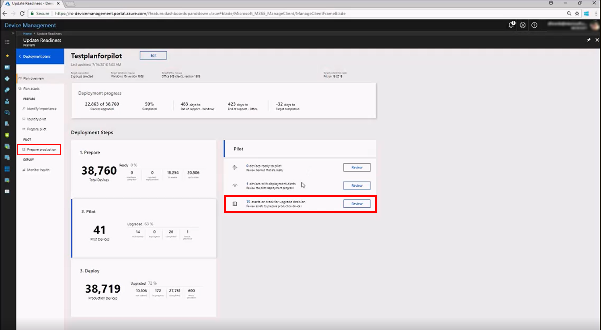
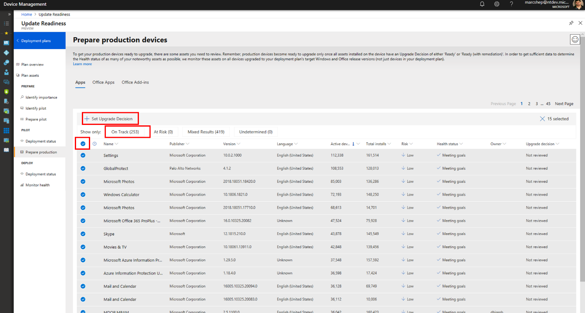

[This information relates to a pre-released product which may be substantially modified before it's commercially released. Microsoft makes no warranties, express or implied, with respect to the information provided here.]

# Deploy to production

There are three main parts to accomplishing the deployment of updates to production devices:

1. [Review assets that need an Upgrade Decision](#review-assets-that-need-an-updgrade-decision)
 To make production devices that were not involved in the pilot deployment ready for production deployment, their Upgrade Decision must be set to **Ready** or **Ready with remediations**.
1. [Deploy to devices that are ready](#deploy-to-devices-that-are-ready)
 To accomplish the actual installation of updates to devices that are ready, you use a device management tool such as System Center Configuration Manager (SCCM). Update Readiness will profvide the list of devices ready for production deployment, as well as reports for monitoring the success of the deployment.
1. [Monitor the health of updated devices](#montor-the-health-of-updated-devices)
 As the update deployment progresses, you might want to monitor the health of noteworthy assets. If some need attention, you can troubleshoot and fix those issues or, if you decide the issues can't be fixed, you can stop the deployment to the affected devices by setting the Upgrade Decision to **Unable** for them.

> [!NOTE]
> You can commence the production deployment at any time you are sufficiently confident in the success of the pilot deployment--there is no requirement that all (or any particular number) of devices in the pilot deployment reach the "completed" state prior to doing so.

## Review assets that need an Upgrade Decision

The **Prepare production** page guides you through the process of reviewing your assets for production deployment. To get to this page, either select **Prepare proeuction** in the left pane or select the **Review** button on the **Deployment plans** page:

This opens a view where you can review the state of apps, Office apps, Office add-ins, and Office macros and use that information to set the upgrade decision for each of those assets.

Use each of the tabs to review the status of apps, Office apps, Office add-ins, and Office macros. In each tabbed view, you can filter the results to show devices that are on track for upgrade (that is, they have no detected issues), those at risk, devices with mixed results, and those in an undetermined state.

Select **On track** to quickly filter the view to assets that are likely to be ready for deployment based on these criteria:

- Risk: our pre-upgrade assessment of known risks for updating devices that have this particular asset installed
- Health status: our assessment of devices in other deployments that have  this asset installed and whether they experienced problems after the update was installed

You can quickly approve these assets for upgrade by selecting the leftmost column header and then selecting **+ Set Upgrade Decision**:

Similarly, you can select **Undetermined** to view assets that could not be classified. These generally are assets that do not have enough coverage for us to perform an analysis of the risk or health status. You might consider adding additional devices with these assets to the pilot or ask pilot users to try these assets to improve the coverage.

{SCREENSHOTS/STEPS FROM RITU}

 There might also be assets in the **At Risk** or **Mixed Results** state that could require additional review from you before you make an upgrade decision for them. Select either of these to obtain additional detailed information. As you review each of these specific resources, you set the upgrade decision for it. For example, in the **Apps** tab, if you click a particular app (such as Notepad++ in this image), you can see detailed statistics about its deployment:

Based on the data displayed there, you can set an upgrade decision for that particular app. In this example, the administrator has indicated that the Office app Excel 2016 is upgrade-ready. For more information, see the [Monitor the health of updated devices](#monitor-the-health-of-updated-devices).

Repeat this process for all apps, Office apps, and Office add-ins. Once a given device has a positive upgrade decision for *all* assets (drivers and all apps, Office apps, and Office add-ins installed on it), then its state changes to "ready for production." You can see the current count on the main page for the deployment plan by clicking **3. Deploy**:

## Deploy to devices that are ready

{separate export from the export for the pilot?}

Export the list of devices {somehow} to pass over to SCCM manually. Once your deployment implementation tool has started the pilot deployment, you can use Update Readiness to monitor the progress and results of the deployment.

### Address deployment alerts

As with the pilot deployment, Update Readiness will advise you of any issues that need your attention during the production deployment.

To get details of reported issues click **Review**. The deployment status details page opens, where you can view lists of the devices in these categories:

- Not started
- In progress
- Completed
- Needs attention - devices
- Needs attention - issues

The **Needs attention** categories show the same information, but sorted differently.

Sorted by affected device:

Sorted by type of issue:

Click a specific listing in either view to get more details about the detected issue:

### Office macros
{SHOULDN'T THE MACRO STUFF GO UP HERE SINCE WHAT YOU CHOOSE THERE AFFECTS THE UPGRADE DECISION?}
If devices in your environment use Office macros, you can review the usage data and advisories offered by Update Readiness in order to further {inform your decisions about which devices to include in the production deployment.}

You can explore further by clicking any specific advisory to see additional details, for example, the relevant list of devices affected. You can also export this list for later use, such as to run the Readiness Toolkit on this subgroup for still more detail about reported issues.

>[!TIP]
>If you plan to run the Readiness Toolkit [LINK](https://aka.ms/readinesstoolkit) on this subgroup, it's best to wait until after the pilot deployment is complete to delve into remediating the reported macro issues.

As you address these deployment issues, the dashboard will continue to show the progress of devices by updating as devices move from **Needs attention** to **Completed**.

You can commence the production deployment at any time you are sufficiently confident in the success of the pilot deployment--there is no requirement that all (or any particular number) of devices in the pilot deployment reach the "completed" state prior to doing so.

## Monitor the health of updated devices

{1)	Overview (filtered to just noteworthy assets in the DP, calculate health status based on regression analysis on health signals, monitor all devices in your enterprise on the DP target versions, provide tshooters to solve issues and can toggle upgrade decision to halt upgrades to devices with problem assets).
2)	Needs attention->health status->tshooters (to remediate) or upgrade decision (to halt future rollouts)

3)	Browsing health.

}

