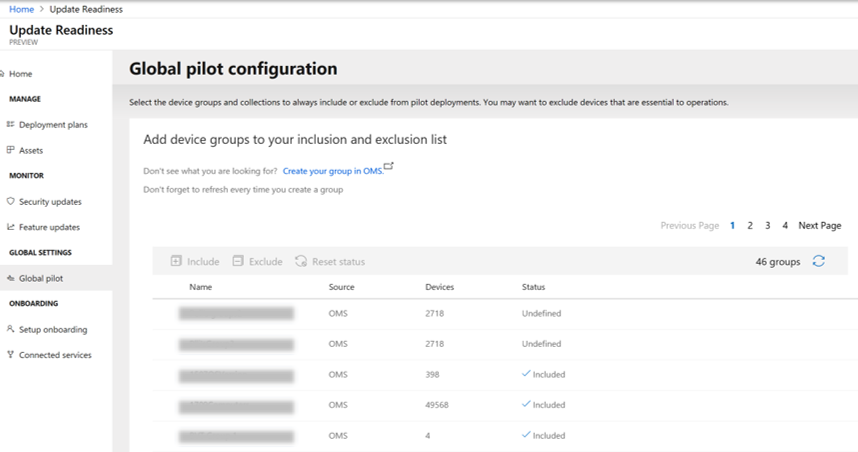
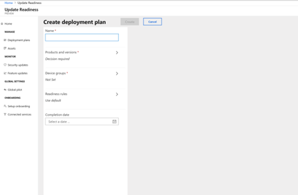
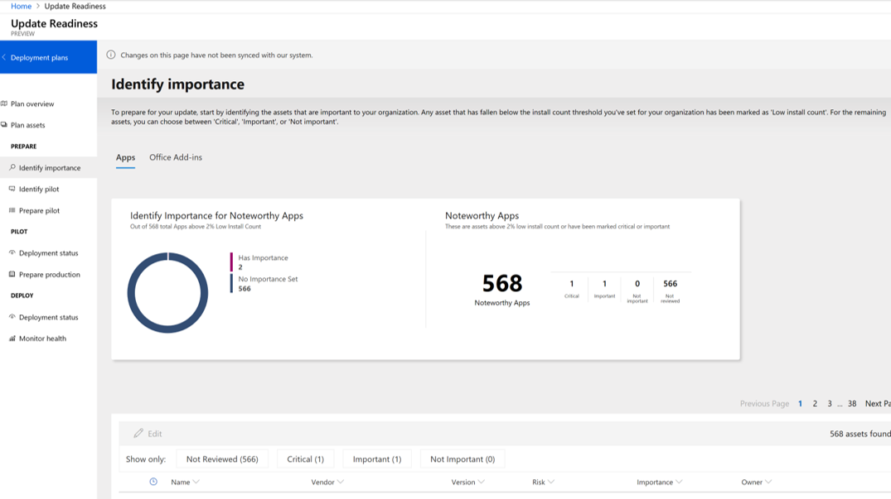
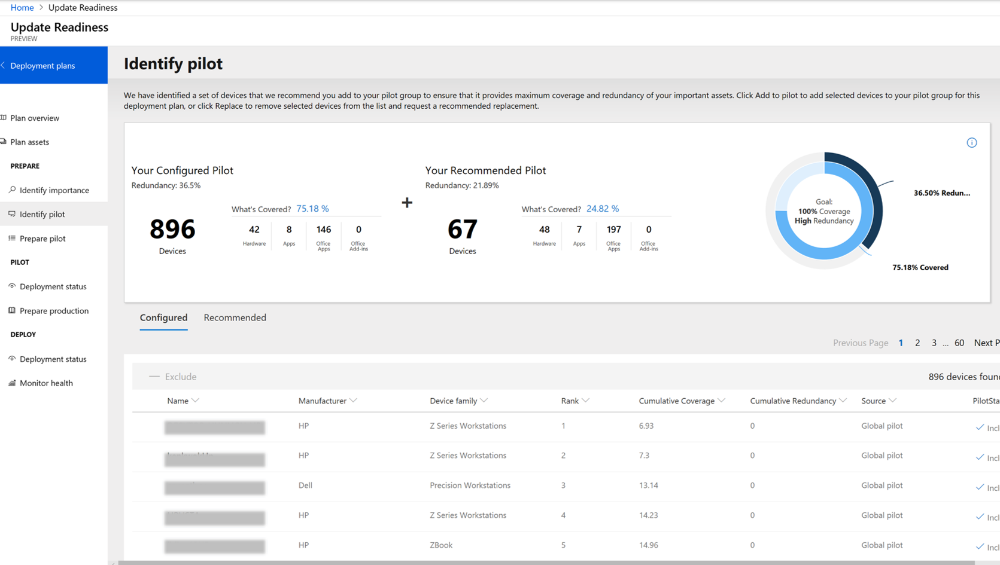
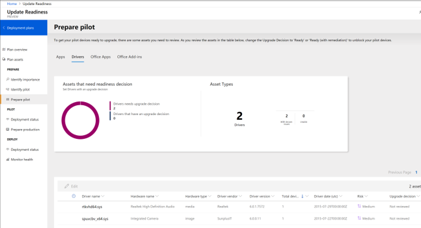

# Create a deployment plan in Update Readiness

> [!IMPORTANT]
> This information relates to a pre-released product which may be substantially modified before it's commercially released. Microsoft makes no warranties, express or implied, with respect to the information provided here.

Follow the steps in this article to use Update Readiness to create a plan for deploying Windows 10 and Office 365 ProPlus.

## What is a deployment plan?

Update Readiness collects and analyzes computer, application, and driver data in your organization. Based on this analysis and your input, you can use the service to create deployment plans for Windows 10 and Office 365 ProPlus. These deployment plans automatically recommend which devices to include in pilots, identify compatibility issues, suggest fixes, and track the progress of your deployment.

As part of your deployment plan, you: 

 - Define what products and versions you want to deploy (Windows 10, Office 365 ProPlus, or both)
 - Choose what groups of devices you want to deploy to
 - Create readiness rules for the deployment, including how Windows is updated on the devices
 - Define the importance of your apps and Office add-ins
 - Choose pilot devices based on automatic recommendations
 - Decide how to fix issues with apps and Office add-ins based on recommendations from Update Readiness

After creating a deployment plan, you can export it to use in System Center Configuration Manager or another software management tool to deploy the products. Once the deployment starts, Update Readiness monitors the deployment based on the settings in the plan.

> [!NOTE]
> Information in Update Readiness is refreshed daily. Any changes you make, such as assigning importance to an app or choosing a device to include in a pilot, may not be reflected for 24 hours.

## Before you begin

Before creating a deployment plan, make sure you've completed the following steps:

- [Get started with Update Readiness](update-readiness-get-started.md)
- [Enroll devices in Update Readiness](update-readiness-enroll-devices.md)
- Define the groups of devices you want to deploy to. [[Need new article to link to. In the meantime, captured limited guidance in the note below.]]

If you've connected Upgrade Readiness to System Center Configuration Manager, you can select your Configuration Manager groups. If you don't use Configuration Manager or if you want to create a new query-based group, click **Create your group in OMS** when choosing target groups. If you create a query-based group, make sure that the query is not based on a computer value that changes as part of the deployment. For more information on how to create groups, see [Computer groups in Log Analytics log searches](https://docs.microsoft.com/en-us/azure/log-analytics/log-analytics-computer-groups). 
 
## Step 1: Configure your global pilot settings

If you haven't already, we recommend configuring your global pilot settings before creating a deployment plan. In these settings, you choose devices that should always be included in or excluded from the pilot stage of a deployment. For example, if you exclude the group Executives, the devices in that group will never be recommended as part of a pilot deployment.

1. On the dashboard, click **Global pilot**.
2. Click **Manage groups for inclusion**, and then choose the groups that should be always be part of the pilot.
3. Click **Manage groups for exclusion**, and then choose the groups that should never be part of a pilot. 

## Step 2: Create a deployment plan

You can create a single deployment plan to cover all your devices or multiple deployment plans to cover different groups of devices and different versions of Windows and Office. 

1. On the dashboard, click **Deployment Plans**.
2. In the **Deployment Plans** pane, click **Create**.
3. In **Create deployment plan**, type a name for the plan.
4. Choose which products and versions to deploy. We recommend creating deployment plans for Office and Windows together and using the most recent versions.
5. Choose the groups you want to deploy to. 
6. Define any readiness rules you want for your deployment plan. As part of your readiness rules, you can specify the following:
 - Whether your devices automatically receive drivers from Windows Update. 
 - Low install count threshold for your Windows apps. If an app is installed on a higher percentage of computers than this threshold, the deployment plan will mark the app as Noteworthy, which means you can decide how important it is to test during the pilot phase.
 - Update Office 365 ProPlus from 32-bit to 64-bit on devices that have a 64-bit version of Windows. Default setting is **Yes**.
 - When updating from an older version of Office, leave older Office apps, even if those apps don't exist in the newer version of Office. Default setting is **No**. 
 - Low install count threshold for your Office add-ins. If an add-in is installed on a higher percentage of computers than this threshold, the deployment plan will mark the add-in as Noteworthy, which means you can decide how important it is to test during the pilot phase.
7. Choose the completion date by which Windows and Office should be fully deployed to all the specified devices.
8. Click **Create**. The new plan will appear in the list of deployment plans.

## Step 3: Set the importance of your apps and Office add-ins

As part of the deployment plan, you set the importance of the apps and Office add-ins that are installed on the devices you're deploying to. This setting helps determine which devices are included in the pilot phase of the deployment. 

Any app or add-in that's installed on less than 2% of the devices targeted in the deployment plan is marked Low Install Count. (Two percent is the default setting; you can adjust the threshold in the readiness settings from 0 to 10%.) Low install count apps and add-ins are automatically marked as **Ready to upgrade**.  

For the remaining apps and add-ins, you can choose **Critical**, **Important**, or **Not important**. If you mark an app or add-in as critical or important, Update Readiness will include some devices with that app or add-in in the pilot deployment. (Making an app or add-in critical means more instances of it will be included in the pilot.) If you mark an app or add-in as Not Important, Upgrade Readiness automatically sets it to **Ready to upgrade**.

To change the importance level of an app or add-in:

1.  On the dashboard, click **Identify importance**.
2. On the apps tab, click **Not Reviewed ** to view the apps that need your input. 
4.  Select the apps you want to change, click **Edit**, and then choose **Critical**, **Important**, or **Not Important **from the **Importance** list. Note that you can select multiple apps to edit at the same time. 
 > [!NOTE]
 > When assigning importance levels, you can also choose the Upgrade decision. We cover that in more depth in [step 5](#step-5-choose-how-to-fix-known-issues).  
6.  Click **Save**.
7. Click the **Office Add-ins **tab, and update the importance of the add-ins.

## Step 4: Choose pilot devices

After you've defined the importance of the apps and Office add-ins, Update Readiness combines that information with the global pilot settings to create a recommendation for which devices should be part of the pilot deployment. The recommended pilot deployment includes devices with different hardware configurations and one or more instances of all the critical and important apps. (If an app is marked critical, the service recommends more devices with that app in the pilot.)

In this step, you review, edit, and approve the pilot recommendations. By the end of this step, you'll have approved a set of devices for the pilot deployment.

1. On the dashboard, click Identify pilot.
2. In the Identify pilot pane, review the recommended devices for the pilot. For each device, do the following:
 - If you agree with the recommendation, select the device and click **Add to pilot**.
 - If you disagree with the recommendation, select the device, and click **Replace** to remove it from the pilot.

For details on how the recommendations are made, click the information icon in the top right corner of the **Identify Pilot** pane.

## Step 5: Choose how to fix known issues 

In this step, you review any known issues with the apps, drivers, and Office add-ins that might block your deployment, and then approve, reject, or modify the suggested fix. All items in this step must be marked **Ready** or **Ready (with remediation)** before the pilot deployment starts. For detailed information on reviewing apps, see [Resolve app and driver issues](https://docs.microsoft.com/en-us/windows/deployment/upgrade/upgrade-readiness-resolve-issues)

1. On the dashboard, click **Prepare pilot**.
2. On the **Apps** tab, review the apps that need your input. For each app, do the following:
 - Click the name of the app and then, in information pane, review the recommendation and choose the upgrade decision. If you choose **Review in progress** or **Unable**, devices with this app will not be upgraded during the deployment.
 - Click **Save**.
5. Repeat step 2 for the drivers, Office apps, and Office add-ins tabs.

## Step 6: Review and export the deployment plan

1. On the dashboard, click **Deployment plans**.
2. Click the deployment plan you just created.
3. Review the details of your deployment plan to make sure:
 - The number of devices is correct
 - The apps and Office add-ins have all been reviewed and upgrade decisions made when needed
 - All pilot devices have been identified
5. To export the deployment plan, go to Log Analytics and [[need steps to do this]].

## Next steps

After exporting the deployment plan, you can use it in Configuration Manager to deploy the products. When the deployment starts, you can use Update Readiness to monitor the progress and results of the deployment. For more details, see [Deploy to production](update-readiness-deploy-production.md).

