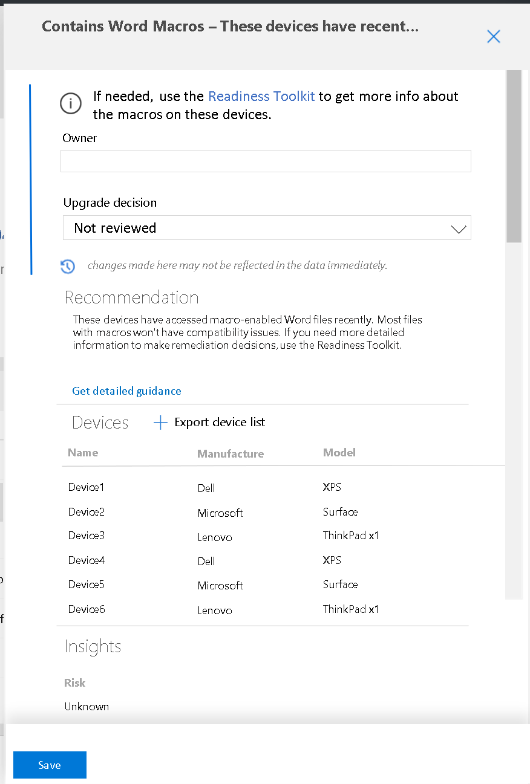

[This a skeleton/outline based on demo by Dhirendra--jwhit to flesh out content. Office macro section is from Tara Hanratty]

# Define deployment plans with Update Readiness

Click **Deployment plans** to view any existing plans. Click {something} to create a new one.

Name it. Pick whether to deploy Windows, Office, or both (this last is recommended).

Device groups--if SCCM connector, pre-populated. If not click Create and you can create an OMS group with Log Analytics (link to existing doc somewhere).

NOTE: don't create query-based groups (like the ones here) using variables that could change. Like "Win7"--as they get upgraded off of Win7, the group shrinks.

## Readiness rules

Stuff like install count.

## Global pilot

You can set large-scale inclusions or exclusions here--like "I don't want any devices in Region X to be considered in deployment plans."

NOTE: changing almost anything (importance, adding/removing things from deployment plan, etc.) typically incurs a wait of ~24 hours for things to fully catch up and appear in the dashboard. 

## Pilot deployment plan

You define importance and other parameters, all of which feed the algorithm that creates the recommended pilot. You can select the tiny "i" thing to see *how* the algorithm decided which devices to include in the recommended pilot. Somewhere explain "redundancy" and "coverage."

To actually create YOUR pilot deployment plan, you click things in the recommended list (you can bulk-select things, sort, filter, etc. to make this less onerous) and then click + Add to pilot. You can also select all if you want to just go with the recommended pilot.

## Prepare pilot

Review the other asset types (apps, drivers, etc.) and set another layer of selection ("Upgrade Decision") based on what you see there. This seems to be pre-filtered to "high risk" assets. So you exclude those or make notes to follow up with certain ones (like if some app has to be manually updated or rebooted or something afterwards).

### Devices
### Apps
### Drivers (?)
### Office
### Office add-ins

### Office macros

If devices in your environment use Office macros, you can review that usage data and advisories offered by Update Readiness in order to further inform your decisions about which devices to include in the pilot deployment.

You can explore further by clicking any specific advisory to see additional details, for example, the relevant list of devices affected. You can also export this list for later use, such as to run the Readiness Toolkit on this subgroup for still more detail about reported issues.

>[!TIP]
>If you plan to run the Readiness Toolkit [LINK] on this subgroup, it's best to wait until after the pilot deployment is complete to delve into remediating the reported macro issues.

## Deploy the pilot

Use SCCM connector (hopefully) to pass off plan to that for implementation. Or you can export some file (XML I think) to pass over to SCCM manually.