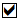

[This information relates to a pre-released product which may be substantially modified before it's commercially released. Microsoft makes no warranties, express or implied, with respect to the information provided here.]

# Get started with Desktop Analytics

This topic explains the steps necessary to configure your environment for Desktop Analytics. 

## Entry points to Desktop Analytics
{NEED INFO FROM THE SCCM EXPERTS}

In {SCCM entry point console}, click {something}, and you will go to the Desktop Analytics console:

## Set up users and workspace

**If your account is not already a global administrator**, you'll have to contact someone who is in order to proceed with setup. This dialog will show you who has the necessary permissions; select the administrators you want to contact and then select **Send**. This will send e-mail to them.

**If you are a global administrator**, click **Start** to continue with setup. You'll need to review and accept the license agreement and confirm that you have the appropriate subscription (E3 or {we should list the appropriate subscriptions explicitly}). If you don't have the appropriate subscription, you should leave the setup dialog and obtain the subscription; you can come back to setup later and continue.

### Configure user access

Desktop Analytics pre-configures two security groups in Azure Active Directory:

- **Workspace Owners**, who can create and manage workspaces. These accounts need owner- or co-owner-level access to an Azure subscription.
- **Workspace Contributors**, who can create and manage deployment plans in this workspace. They do not need any additonal Azure access.

To add a user to either group, type their name or e-mail address in the **Enter name or email address** section of the appropriate group.

### Prepare your workspace

**If you don't already have an Azure subscription**, a dialog box will offer you the opportunity to obtain one. If you do have an Azure subscription, the portal will display all of your existing workspaces. To use an existing workspace for Desktop Analytics, just select it.

>[!NOTE]
>If you are already using Windows Analytics, you can just select the workspace you're using for that from this list and all data and configuration will transfer to Desktop Analytics.

To create a new workspace, select **+ Create new workspace** and in the dialog that opens, provide a name for the new workspace, use the pull-down menu to select the Azure ID you want to use, select the region, and then click **Create**.

The new workspace will appear at the top of the workspace list and is pre-selected; to use the new workspace, select **Set as Workspace**, and then click **Continue** in the **Accept Permissions** dialog that opens.

### Provision the reverse datapump {maybe we can come up w/ a friendlier term for this}

You will need someone with global administrator permissions to complete these steps.

1. Give a security principal in your Azure Active Directory (AAD) tenant access to the MALogAnalyticsReader application 
the admin consent for the reserveDataPump app:  {I would clean up this sentence but I'm not totally sure what it's trying to say} {also, the provided link in the OneNote just takes me to Microsoft.com--so I guess there's some piece of UI we are trying to show here?}
2. Log into the Azure Portal (http://portal.azure.com) with your AAD acount. If you are presented with a dialog asking permission, approve it.
3. Search Azure resources for a resource of **type=LogAnalytics** which has the same name as the OMS workspace you created. In this example, the workspace is "MA-Smoke-EUS".
4. Click the workspace name to see the details, and then select **Access control (IAM)**.
5. Select **+ Add** and then select **Role = 'Log Analytics Reader'**. Enter *MALogAnalyticsReader* in the **Select** box
6. When this user is found, select it, and then select **Save** near the bottom of the panel.

### Complete setup

At this point, you have the option to proceed to [enrolling your devices](update-readiness-enroll-devices.md), or you can go directly to the dashboard and enroll devices later. If you go to the dashboard at this point, you will see something like this:

If you've come to the dashboard prior to enrolling devices, select **Connected Services** {or is it Connect devices?} to proceed with [enrolling devices](update-readiness-enroll-devices.md).

If your devices are already enrolled, you skip ahead to [Additional steps after device enrollment in Desktop Analytics](update-readiness-additonal-steps.md).

| | |
| --- | --- |
|  | Learn about Desktop Analytics |
|  | Get started with accounts, subscriptions, user access, workspaces: [Get started with Desktop Analytics](update-readiness-get-started.md) (this topic) |
|  | Enroll devices in Desktop Analytics to start the flow of diagnostic data: [Enroll devices in Desktop Analytics](update-readiness-enroll-devices.md)|
|  | Additional steps after device enrollment in Desktop Analytics: [Additional steps after device enrollment in Desktop Analytics](update-readiness-additonal-steps.md) |
| | Set up deployment plans -- define detailed deployment plans for pilot and production: [Define deployment plans with Desktop Analytics](update-readiness-deployment-plans.md) |
|  | [Deploy pilot with Desktop Analytics](update-readiness-deploy-pilot.md) |
|  | Deploy to production: [Deploy to production with Desktop Analytics](update-readiness-deploy-production.md) |
|  | Monitor status and health of the deployment: [Monitor the health and update status of devices](update-readiness-monitoring.md) |
|                                      |                                                    |
|    | Additional information: [Troubleshooting](update-readiness-troubleshooting.md)  |

## Related topics
