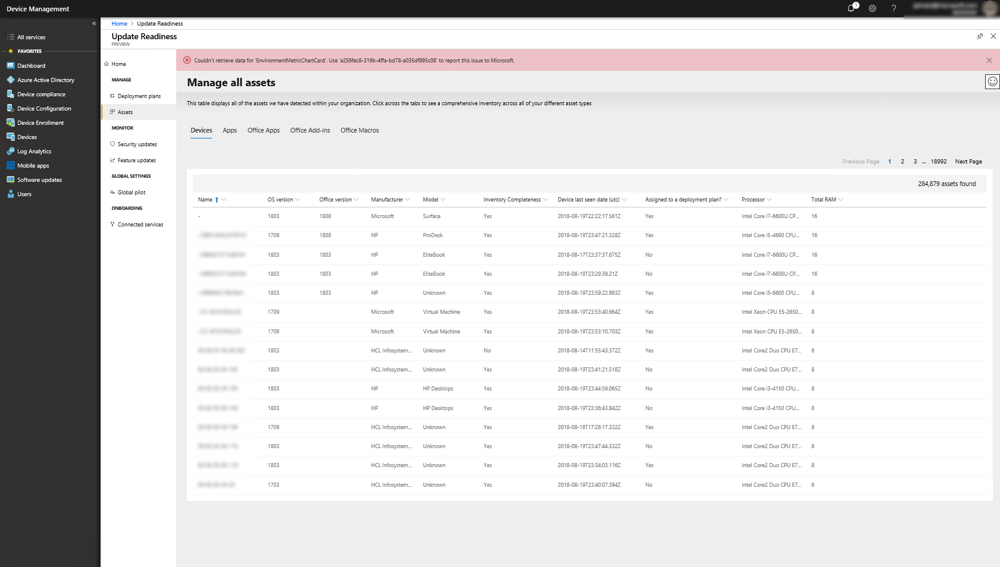

[This information relates to a pre-released product which may be substantially modified before it's commercially released. Microsoft makes no warranties, express or implied, with respect to the information provided here.]

# Get started with Updated Readiness

This topic explains the steps necessary to configure your environment for Update Readiness. 

Steps are provided in sections that follow the recommended setup process:

## Entry points to Update Readiness
{Which of these are functional currently?}

### From M365 Device Management {most likely for PP}
### From System Center Configuration Manager
### From Azure

In {entry point console}, click {something}, and you will go to the Update Readiness console:

## Set up users and workspace

**If your account is not already a global administrator**, you'll have to contact someone who is in order to proceed with setup. This dialog will show you who has the necessary permissions; select the administrators you want to contact and then select **Send**. This will send e-mail to them.

**If you are a global administrator**, click **Start** to continue with setup. You'll need to review and accept the license agreement and confirm that you have the appropriate subscription (E3 or {we should list the appropriate subscriptions explicitly}). If you don't have the appropriate subscription, you should leave the setup dialog and obtain the subscription; you can come back to setup later and continue.

### Configure user access

Update Readiness pre-configures two security groups in Azure Active Directory:

- **Workspace Owners**, who can create and manage workspaces. These accounts need owner- or co-owner-level access to an Azure subscription.
- **Workspace Contributors**, who can create and manage deployment plans in this workspace. They do not need any additonal Azure access.

To add a user to either group, type their name or e-mail address in the **Enter name or email address** section of the appropriate group.

### Prepare your workspace

**If you don't already have an Azure subscription**, a dialog box will offer you the opportunity to obtain one. If you do have an Azure subscription, the portal will display all of your existing workspaces. To use an existing workspace for Update Readiness, just select it.

>[!NOTE]
>If you are already using Windows Analytics, you can just select the workspace you're using for that from this list and all data and configuration will transfer to Update Readiness.

To create a new workspace, select **+ Create new workspace** and in the dialog that opens, provide a name for the new workspace, use the pull-down menu to select the Azure ID you want to use, select the region, and then click **Create**.

The new workspace will appear at the top of the workspace list and is pre-selected; to use the new workspace, select **Set as Workspace**, and then click **Continue** in the **Accept Permissions** dialog that opens.

### Complete setup

At this point, you have the option to proceed to [enrolling your devices](update-readiness-enroll-devices.md), or you can go directly to the dashboard and enroll devices later. If you go to the dashboard at this point, you will see something like this:

If you've come to the dashboard prior to enrolling devices, select **Connected Services** {or is it Connect devices?} to proceed with [enrolling devices](update-readiness-enroll-devices.md).

If your devices are already enrolled, you can start getting familiar with the dashboard:

## Review assets

Once device enrollment is complete, you should review carefully the inventory of reported devices and other assets to determine if any are missing or are reporting unexpected data. Your devices, drivers, apps, Office apps, Office add-ins, and Office macros are visible as items under **Assets**:

### Devices

Key information about all devices in your organization that are enrolled. You can sort on any column or filter for particular values.

### Apps

Similarly, the Apps tab shows all installed apps detected on your Windows devices.

"Noteworthy" apps are those that are installed on more than 2% of enrolled devices. You can change the threshold of "noteworthy" by {doing something}. You can also set the *Importance* of apps by categorizing them into these categories:

- Critical
- Important
- Ignore
- Not reviewed

To set the importance of an app, click it to get its detailed view, and then use the **Importance** pull-down menu to choose a value. You can also assign an owner, as in this example from Office add-ins:

### Office apps

Office apps (such as Microsoft Word or Excel) are displayed similarly, though there is no categorization or "noteworthy" count. You set the importance and owner for the Office app the same way as with other apps or add-ins.

### Office add-ins

Office add-ins (for example, an e-mail scanner or iCloud add-in) are displayed similarly, including the "noteworthy" count and the means to categorize importance as with apps. You can view details of any add-in by clicking it.

### Office macros

This section shows whether reporting devices have accessed any files recently that are capable of including macros. (For a detailed list of these file types, see [File formats supported in the 2007 Office system (corrected)](https://blogs.technet.microsoft.com/office_resource_kit/2009/04/04/file-formats-supported-in-the-2007-office-system-corrected/) at the Office IT Pro blog.)

>[!NOTE]
>If you have run the Readiness Toolkit [LINK](https://aka.ms/readinesstoolkit) on any devices in your environment, additional data from those devices will be displayed here as well. However, there is no need to obtain or run the Readiness Toolkit to use any aspect of Update Readiness.

## Monitor current state of updates in the environment

{SUPERCEDED by "global-monitoring" topic--should we link to that here or just delete this section in this topic?}

{not sure if this is really part of the flow prior to setting the deployment plan or if it's better in "ongoing monitoring"--or both?}

Knowing the current status of updates in your environment will be helpful as you formulate a deployment plan in the next step.

### Security updates

To review the current status of security updates, click **Security updates** in the **Monitor** section of Update Readiness:

Click **Windows 10** or **Office 365 ProPlus** to see the respective status for each of those entities.

### Feature updates

To review the current status of feature updates, click **Feature updates** in the **Monitor** section of Update Readiness:

Click **Windows 10** or **Office 365 ProPlus** to see the respective status for each of those entities.

## Troubleshooting
{should we have some steps in case things aren't showing up as expected?}

When you've reviewed all assets and have set whatever values you like, you are ready to move on to creating a pilot [deployment plan](update-readiness-deployment-plans.md).

## Related topics
