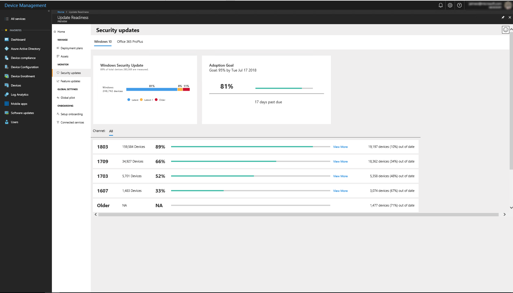
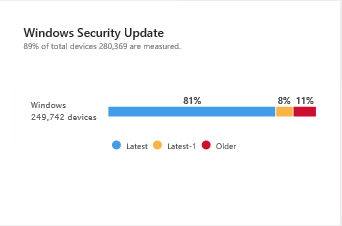
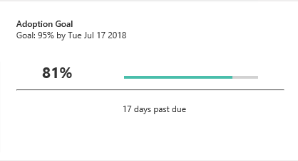
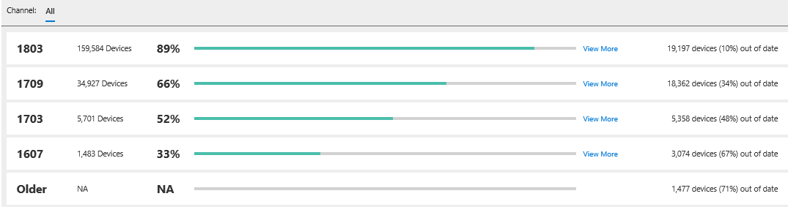

[This information relates to a pre-released product which may be substantially modified before it's commercially released. Microsoft makes no warranties, express or implied, with respect to the information provided here.]

# Monitor the health and update status of devices
--- {SOME TEXT TO AVOID STACKED HEADINGS}

## Monitor the current state of updates in the environment

Knowing the current status of updates in your environment will be helpful as you formulate a deployment plans in the future.

### Security updates

To review the current status of security updates, select **Security updates** in the **Monitor** section of Update Readiness:

Select **Windows 10** or **Office 365 ProPlus** to see the respective status for each of those entities.

The **Security updates** tile shows the status of security updates on Windows 10 devices in your organization:

The text under the tile's title indicates what percentage of the devices monitored are running Windows 10, while the report indicates the security status of those devices. The number of devices constituting that percentage is displayed next to the bar chart.

Devices in the bar chart are categorized as follows:

| **Label**  | **Definition**  |
|---------------------------------------------------------|-----------|
| Latest | Devices are running the latest security update per release version and release channel.|
| Latest-1 | Devices are running a security update one release older than the latest available update on that channel and a build that is not thge most current. |
| Older | Devices are running a security update older than Latest -1. |

The **Adoption goal** tile shows the progress of adoption of the latest available security update. This goal is not user-configurable--it is set to 95% adoption within seven days of a security update release:

Below these two tiles is a section showing the adoption trend on a per-version basis (in this example, the trend is shown for each Windows 10 release version):

 Channel info?{SIC} Each row shows the total number of devices running the indicated Windows 10 release, followed by the percentage of devices that are running the latest security update for that release, a link for additional details, and the number of devices (as a percentage of the total number of Windows 10 devices) that are out of date with respect to security updates. You can also select **View More** to see the adoption trend over time.

### Feature updates

To review the current status of feature updates, select **Feature updates** in the **Monitor** section of Update Readiness:

Select **Windows 10** or **Office 365 ProPlus** to see the respective status for each of those entities.