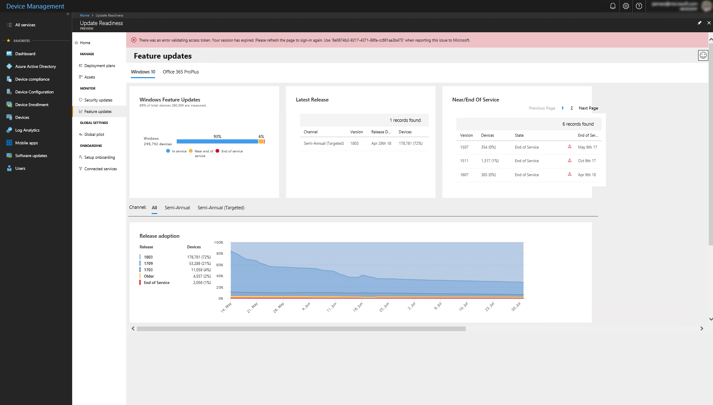

[This information relates to a pre-released product which may be substantially modified before it's commercially released. Microsoft makes no warranties, express or implied, with respect to the information provided here.]

# Monitor the health and update status of devices
--- {SOME TEXT TO AVOID STACKED HEADINGS}

## Monitor the current state of updates in the environment

Knowing the current status of updates in your environment will be helpful as you formulate a deployment plans in the future.

### Security updates

To review the current status of security updates, select **Security updates** in the **Monitor** section of Desktop Analytics:

Select **Windows 10** or **Office 365 ProPlus** to see the respective status for each of those entities.

#### Windows 10

The **Security updates** tile shows the status of security updates on Windows 10 devices in your organization:

The text under the tile's title indicates what percentage of the devices monitored are running Windows 10, while the report indicates the security status of those devices. The number of devices constituting that percentage is displayed next to the bar chart.

Devices in the bar chart are categorized as follows:

| **Label**  | **Definition**  |
|---------------------------------------------------------|-----------|
| Latest | Devices are running the latest security update per release version and release channel.|
| Latest-1 | Devices are running a security update one release older than the latest available update on that channel and a build that is not the most current. |
| Older | Devices are running a security update older than Latest -1. |

The **Adoption goal** tile shows the progress of adoption of the latest available security update. This goal is not user-configurable--it is set to 95% adoption within seven days of a security update release:

Below these two tiles is a section showing the adoption trend on a per-version basis (in this example, the trend is shown for each Windows 10 release version):

 Channel info?{SIC} Each row shows the total number of devices running the indicated Windows 10 release, followed by the percentage of devices that are running the latest security update for that release, a link for additional details, and the number of devices (as a percentage of the total number of Windows 10 devices) that are out of date with respect to security updates. You can also select **View More** to see the adoption trend over time.

The table to the left shows the breakdown of devices by update versions as of the latest available data snapshot. This corresponds to the data represented on the most recent date on the graph. The first row shows the latest release version and corresponds to the percent of total devices considered Latest for that release. The next two rows make up the devices that are considered “out of date”, and error details for which are to the right-hand side of the graph.

The graph shows rate of adoption across devices on a release from the first date that a security update was available for the version up to now. 

The table to the right of the graph shows possible deployment errors that have occurred on devices in the process of moving to the latest security update. The table shows the top five errors. Select **See All** to view all deployment errors for the release.

#### Office 365 ProPlus

The Security updates tile shows the status of Office security updates on Windows 10 devices in your organization:

The text under the tile's title indicates the percentage of devices that are running Office 365 ProPlus, while the report indicates the security status of those devices. The number of devices constituting that percentage is displayed next to the bar chart.

### Feature updates

To review the current status of feature updates, select **Feature updates** in the **Monitor** section of Desktop Analytics:

Select **Windows 10** or **Office 365 ProPlus** to see the respective status for each of those entities.

| | |
| --- | --- |
|  | Learn about Desktop Analytics |
|  | Get started with accounts, subscriptions, user access, workspaces: [Get started with Desktop Analytics](update-readiness-get-started.md) |
|  | Enroll devices in Desktop Analytics to start the flow of diagnostic data: [Enroll devices in Desktop Analytics](update-readiness-enroll-devices.md)|
|  | Additional steps after device enrollment in Desktop Analytics: [Additional steps after device enrollment in Desktop Analytics](update-readiness-additonal-steps.md) |
|  | Set up deployment plans -- define global rules and detailed deployment plans for pilot and production: [Define deployment plans with Desktop Analytics](update-readiness-deployment-plans.md) |
|  | [Deploy pilot with Desktop Analytics](update-readiness-deploy-pilot.md) |
|  | Deploy to production: [Deploy to production with Desktop Analytics](update-readiness-deploy-production.md) |
| | Monitor status and health of the deployment: [Monitor the health and update status of devices](update-readiness-monitoring.md) (this topic) |
|                                      |                                                    |
|    | Additional information: [Troubleshooting](update-readiness-troubleshooting.md)  |