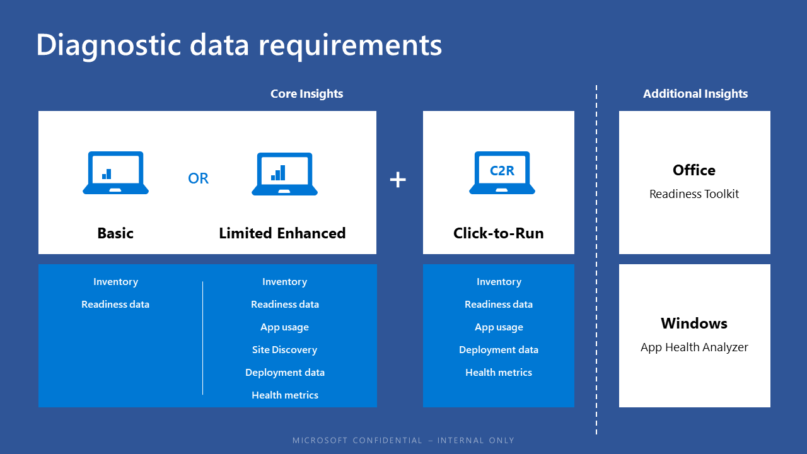

[This information relates to a pre-released product which may be substantially modified before it's commercially released. Microsoft makes no warranties, express or implied, with respect to the information provided here.]

# Desktop Analytics

{Basic overview; links to subtopics showing basic user flow}

## Intro/overview material
{stolen from a recent e-mail}
Desktop Analytics tool provides you with these key benefits relating to Desktop Analytics for the Modern Workplace offerings of Windows 10 and Office 365 ProPlus:

- Device and software inventory, including apps, add-ins, and macros, versions of Office and Windows, and more.
- Pilot identification, including automatically identifying the smallest set of devices that will provide the widest coverage of apps, add-ins, macros, and other factors important for early piloting. This will allow for efficient and effective piloting of Office and Windows upgrades/updates such that customers can proceed more quickly – and with more confidence – to broad deployments.
- Issue identification and mitigation suggestions, backed by broad market and within-tenant data that is appropriately leveraged to predict where there likely are – and aren’t – issues.
- Tight integration with SCCM, which makes the Desktop Analytics data quickly actionable for deploying and managing Windows and Office.

{QUESTIONS WE SHOULD BE ANSWERING FOR OUR CUSTOMERS IN THIS TOPIC}
- what pre-requisites do I need to use Desktop Analytics?
- what Azure accounts/licenses do I need to budget for and obtain?
- are there domain requirements?
- can I run DA from any computer? Does it matter what OS that computer is running? Could I run it from Windows Server w/ Desktop Experience?
- what Windows and Office versions on the clients are required in order to be monitored/managed by Desktop Analytics?
- does it cost anything?

## Diagnostic data required

{WHAT DO WE NEED TO SAY ABOUT PRIVACY? WA HAS A WHOLE SEPARATE TOPIC ON THIS--IS IT RELEVANT TO DA SO WE CAN GENERALIZE THAT TOPIC? OR IS THE PRIVACY/DATA STORY DIFFERENT ENOUGH THAT A NEW TOPIC IS NEEDED REGARDING PRIVACY/DATA IN DA?}

## Steps to use Desktop Analytics

| | |
| --- | --- |
|  | Learn about Desktop Analytics (this topic) |
|  | Get started with accounts, subscriptions, user access, workspaces: [Get started with Desktop Analytics](update-readiness-get-started.md) |
|  | Enroll devices in Desktop Analytics to start the flow of diagnostic data: [Enroll devices in Desktop Analytics](update-readiness-enroll-devices.md)|
|  | Additional steps after device enrollment in Desktop Analytics: [Additional steps after device enrollment in Desktop Analytics](update-readiness-additonal-steps.md) |
|  | Set up deployment plans -- define and detailed deployment plans for pilot and production: [Define deployment plans with Desktop Analytics](update-readiness-deployment-plans.md) |
|  | [Deploy pilot with Desktop Analytics](update-readiness-deploy-pilot.md) |
|  | Deploy to production: [Deploy to production with Desktop Analytics](update-readiness-deploy-production.md) |
|  | Monitor status and health of the deployment: [Monitor the health and update status of devices](update-readiness-monitoring.md) |
|                                      |                                                    |
|
   | Additional information: [Troubleshooting](update-readiness-troubleshooting.md)  |

