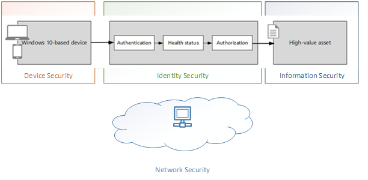

# Security in Microsoft Managed Desktop

<!--Security -->

By using many Microsoft technologies, we can ensure that Microsoft Managed Desktop devices are secure and that the Microsoft Managed Desktop security ops team can prevent, detect, and respond to advanced threats. Third-party security products, apps, and services are not allowed. Microsoft will apply a standard policy baseline to ensure devices, identity, network, and corporate data are secured and protected.

These categories of security enforcement are documented in the following sections:
- [Device security](#device-security) – ensure Microsoft Managed Desktop devices are secure
- [Identity security](#identity-security) – ensure users in the modern workplace are not compromised
- [Network security](#network-security) – ensure a secure access to corporate resources
- [Information security](#information-security) – ensure corporate data is secure

## Device security

To prevent security breaches, it’s important to ensure all Microsoft Managed Desktop devices are healthy and secured. It’s equally important to ensure we can detect unhealthy devices and mitigate the risk as early as possible.

The following table lists the services provided to ensure Microsoft Managed Desktop devices are trusted, healthy and secured.

Service | Description
--- | ---
Antivirus |	We will ensure that: - Windows Defender AV is installed and configured - Windows Defender AV definitions are up to date
Full Volume Encryption |	Windows BitLocker is the data encryption solution for Microsoft Managed Desktop devices.  Once an organization is onboarded into the service, devices will be encrypted using Windows BitLocker with built-in Trust Platform Module (TPM) to prevent unauthorized access to local data when the device is in sleep mode, or off. 
Monitoring |	Windows Defender Advanced Threat Protection (Windows Defender ATP) is the security threat monitoring solution for all Microsoft Managed Desktop devices. Windows Defender ATP allows enterprise customers to detect, investigate and respond to advanced threats in their corporate network. For more information, see [Windows Defender Advanced Threat Protection.](https://docs.microsoft.com/windows/threat-protection/windows-defender-atp/windows-defender-advanced-threat-protection) 
Software updates |	Microsoft will ensure that Microsoft Managed Desktop devices are always secured with the latest security update, for Windows and Office, using Windows Update for Business.
Recovery |	Corporate data is stored on OneDrive for business and can be easily restored for Microsoft Managed Desktop devices. For more information, see [OneDrive for Business.](https://support.office.com/article/Restore-a-previous-version-of-a-file-in-OneDrive-159cad6d-d76e-4981-88ef-de6e96c93893?ui=en-US&rs=en-US&ad=US) 

## Identity security

Identity and access management protects corporate assets and business-critical data. Azure Active Directory (Azure AD) provides identity services in the cloud and enable cloud-based authentication that ensures only trusted individuals can access corporate resources from Microsoft Managed Desktop devices.

Service | Description
--- | ---
Enterprise grade authentication provider |	Azure AD Premium editions used by Microsoft give you a high-availability service hosted in globally-distributed datacenters. The service handles billions of authentications each day from more than 200 million active users and gives you a 99.9% SLA.
Biometric Authentication |	Windows Hello allows users to login using their face or a PIN, making passwords harder to forget or steal. This might require additional work to configure. For more information, see [Windows Hello.](https://docs.microsoft.com/windows-hardware/design/device-experiences/windows-hello)
Multi factor authentication	| Azure multi-factor authentication prevents unauthorized access to on-premises and cloud applications by providing an additional level of authentication using a mobile phone, as well as self-service password reset. 
Standard user permission |	To protect the system and make it more secure, the user will be assigned Standard User Permissions. This is assigned as part of the Windows Autopilot out-of-box experience.

## Network security

Customers are responsible for network security. 

Service | Description
--- | ---
VPN | Customers own their VPN infrastructure, to ensure limited corporate resources can be exposed outside the intranet.  Minimum requirement: Microsoft Managed Desktop requires a Windows 10 compatible and supported VPN solution. If your organization needs a VPN solution, it needs to support Windows 10 and be packaged and deployable through Intune. Contact your software publisher for more information.  Recommendation: - Microsoft recommends a Modern VPN solution that could be easily deployed through Intune to push VPN profiles. This provides an always-on, seamless, reliable, and secure way to access corporate network. For more information, see VPN settings in Intune. - Thick VPN clients, or legacy VPN clients, are not recommended by Microsoft while using Microsoft Managed Desktop as it can impact the end-user environment. - Microsoft recommends that the outgoing web traffic goes directly to Internet without going through the VPN to avoid any performance issues. - Ideally, Microsoft recommends the use of Azure Active Directory App Proxy instead of a VPN.

## Information security

Customers may configure these optional services to help protect corporate high-value assets. 

Service | Description
--- | ---
Conditional access |	Allow access to corporate resources and services only when the device is compliant.
Data recovery  | Information stored in key folders on the device is backed up to OneDrive for Bbusiness. Microsoft Managed Desktop is not responsible for data that isn’t synchronized with OneDrive for Business. 
Windows Information Protection |	For companies that require high levels of information security, we recommend [Windows Information Protection](https://docs.microsoft.com/windows/threat-protection/windows-information-protection/protect-enterprise-data-using-wip) and [Azure Information Protection.](https://www.microsoft.com/cloud-platform/azure-information-protection). 

