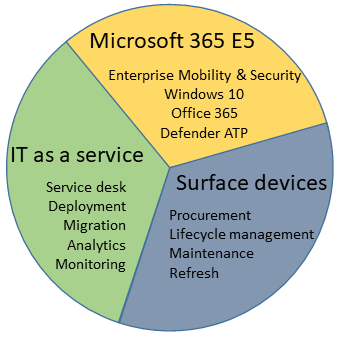

# How Microsoft 365 Managed Desktop works

With Microsoft 365 Managed Desktop, you get: **software as a service**, **devices as a service**, and **IT support as a service**. 

When you enroll in M365 Managed Desktop, Microsoft provides you with devices that are configured to join your Azure Active Directory tenant. Windows 10, Office 365, and some apps and features associated with [Microsoft 365 Enterprise E5](https://www.microsoft.com/en-us/microsoft-365/compare-all-microsoft-365-plans) are installed (by Microsoft) on your devices. When your employees who are using these devices need help, they contact M365 Managed Desktop support (provided by Microsoft) through a custom chat app. 

### The shipment arrives

People in the workcenter unpack their new Surface laptops. Adelaide turns on her laptop and enters her Azure AD credentials. Her laptop is immediately joined to your Azure AD tenant for management, and is configured with settings, policies, and software so that she can get right to work.

### Device is up-to-date

Updates for Windows, Office, and apps are applied to these managed devices, according to the update rings that you helped to define.

### When something goes wrong

Adelaide opens the Help app and is soon chatting with a support technician from Microsoft who will help her resolve her problems.